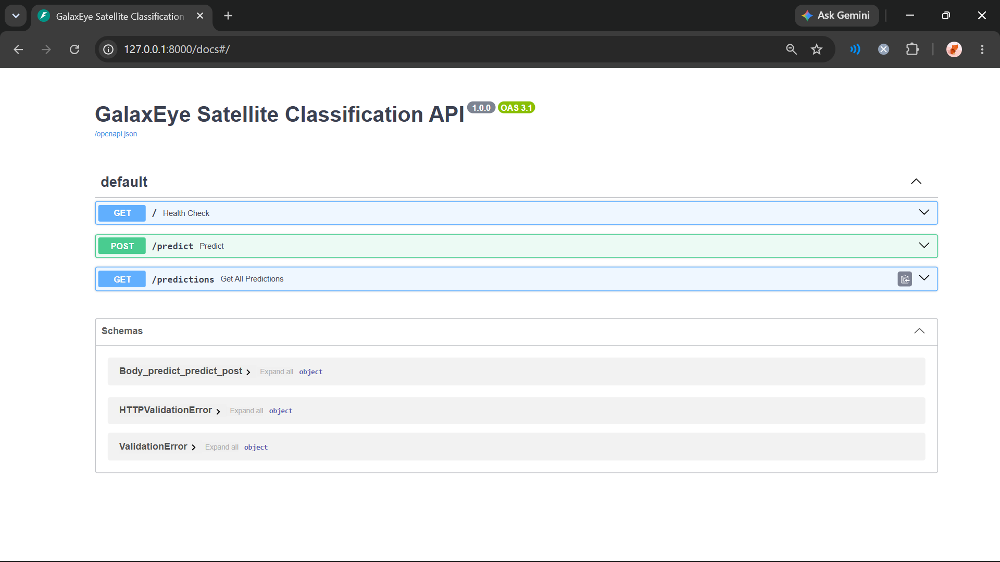
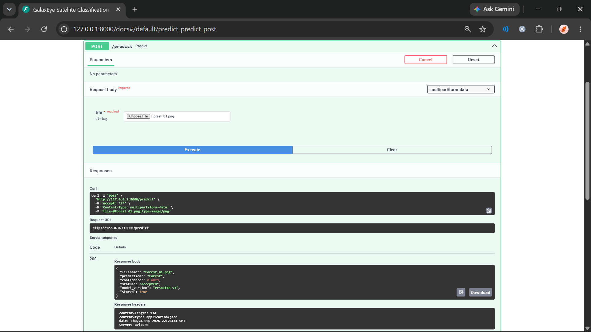
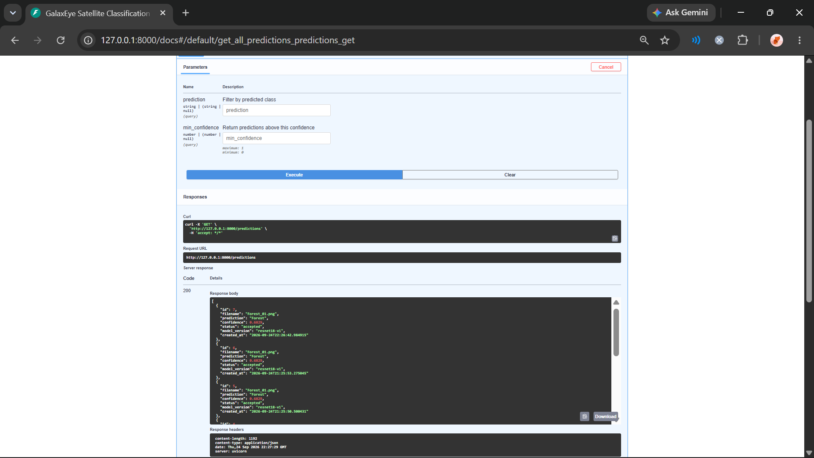
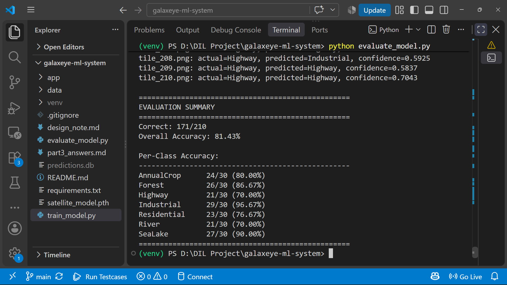

# GalaxEye Backend Engineer — ML Systems Take-Home

An offline satellite image classification service built with Python, FastAPI, PyTorch and SQLite.

The service accepts a satellite image tile, classifies it using a locally stored ResNet18 model, stores the prediction with confidence and model version, and provides an API for querying stored results.

## Architecture

Satellite Tile
      |
      v
POST /predict
      |
      v
Image Validation
      |
      v
Image Preprocessing
      |
      v
Local ResNet18 Model
      |
      v
Prediction + Confidence
      |
      v
Confidence Check
      |
      +---- accepted
      |
      +---- uncertain
      |
      v
SQLite Storage
      |
      v
GET /predictions

## Screenshots

### API Documentation

### Prediction Result

### Stored Predictions

### Model Evaluation

